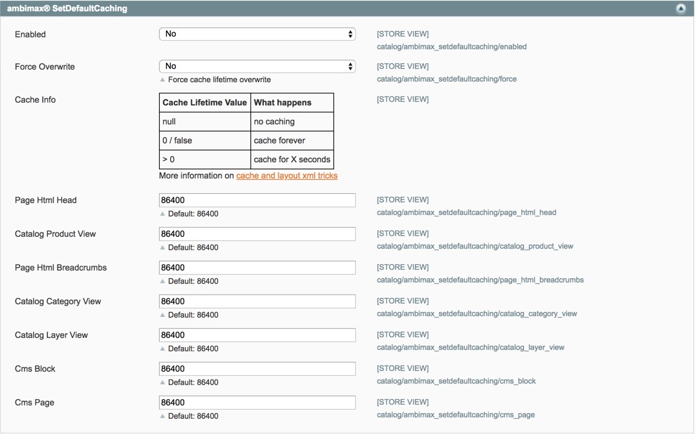

# ambimax® SetDefaultCaching

[](https://travis-ci.org/ambimax/magento-module-ambimax-setdefaultcaching)

Sets default caching lifetime in Magento 1.

## Configuration

Some block types can be set with a default cache lifetime. The settings can be found in `System > Configuration > Catalog`



##  Installation

For installation use composer or copy files manually.

### composer
```
"require": {
    "ambimax/magento-module-ambimax-setdefaultcaching": "^1.0.0"
}
```


## License

[MIT License](http://choosealicense.com/licenses/mit/)

## Author Information

 - [Tobias Schifftner](https://twitter.com/tschifftner), [ambimax® GmbH](https://www.ambimax.de)